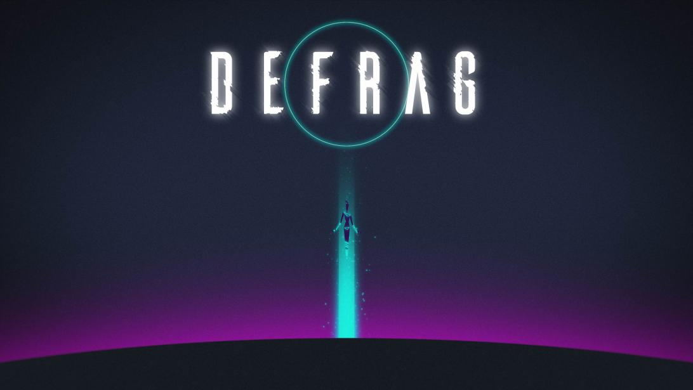
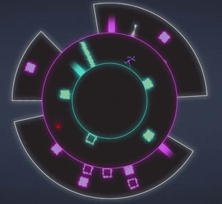
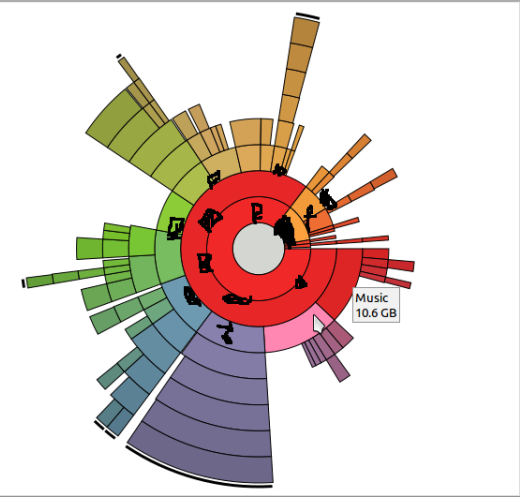
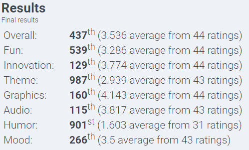

# LD42  - Defrag

_My entry for the Ludum Dare 42 (august 2018)_

Did you think your computer defrag process was all about code and stuff? 
This game is here to show you that when we're running out of space, and the computer needs cleaning, there is a lil' guy who goes on a great adventure to help us...

Between traps and pitfalls, our small friend will have to make his way out of the disk through its different slices.
Time boosters and special slice specific glitches (music/video...) will make your journey even trippier! 

Thank you very much for playing our game, we hope that you'll have a lot of fun with it!

# Dev Process

We decided to go in a computer related theme (50% of the team is developers, they were pretty convincing), and with the vision of the good old defrag tool, the idea just.. came up!

It was all an adventure for 4 of the 5 devs who had never used Unity before, but in the end it went fairly smooth and we were able to create this game, packed with awesome graphics and soundtracks full of a dark synthwave/Tron-ish vibe made on the fly over the weekend!

# Controls

| Action | key |
| -------| --- |
| Move clockwise | Right Arrow |
| Move counter-clockwise | Left Arrow |
| Jump | Up Arrow |
| Slide | Down Arrow |
| Attack | Space |

# Team

| Member | Role |
| ------ | ---- |
| Florian Coulouma | Game Design |
| Thibault Palluet | Game Design |
| Corentin Bescond | Graphics|
| Leo Delisle | Graphics |
| Baptiste Tiers | Programming |
| David Maidenberg | Programming |
| Guillaume Gomez | Programming |
| Raphael Beltrand | Programming |
| Victor Goya | Programming |
| Terence Toussaint | Sound Design |

2017 entries

[Link to ludum dare page](https://ldjam.com/events/ludum-dare/42/defrag-3)
